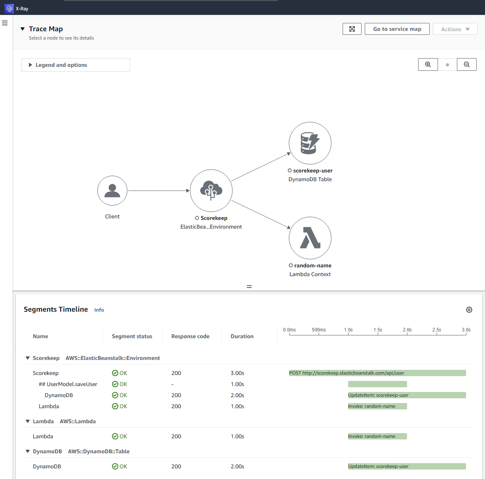
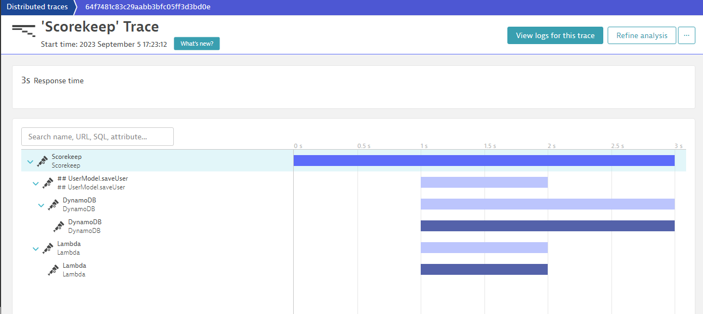
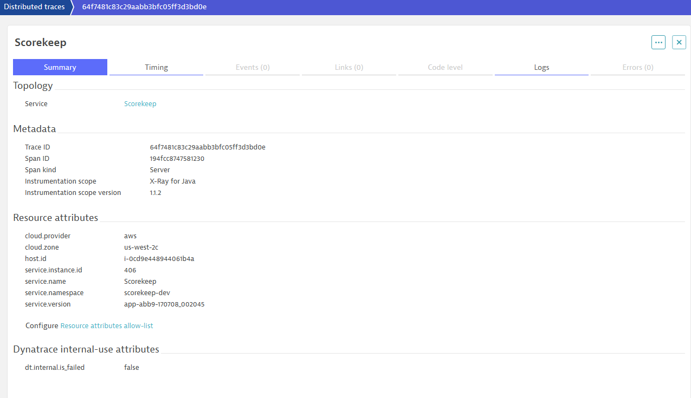

# AWS X-Ray Exporter for OpenTelemetry

This project allows to read trace telemetry (segment documents) pulled from AWS X-Ray REST-Api and convert/forward to an OpenTelemetry OTLP compatible endpoint. 

It enables an observability solution to analyze the trace telemetry directly captured via e.g. OpenTelemetry together with X-Ray instrumented AWS services. Especially for fully managed (serverless) services such as Amazon API Gateway, which ONLY [support tracing using X-Ray](https://docs.aws.amazon.com/apigateway/latest/developerguide/apigateway-enabling-xray.html), the integration of X-Ray gives much better insights and end-2-end visibility. 

### What about trace correlation 
As AWS X-Ray only supports its proprietary trace-context, a transaction which passes multiple tracing systems such as X-Ray and OpenTelemetry (using W3C-TraceContext), will generate separated traces. To follow such a transaction you need to correlate the traces by capturing the trace-context from the incoming different tracing system. This concept is also called *span-linking*. 

## How does it work?

The solution contains several projects: 

#### XRay2OTLP
XRayOTLP is a library to convert AWS X-Ray segment documents into the OpenTelemetry format OTLP. 

#### XRayConnector 
XRayConnector implements the polling logic for the AWS X-Ray REST-Api: https://docs.aws.amazon.com/xray/latest/devguide/xray-api-gettingdata.html. The logic is implemented using [Azure Durable Function](https://learn.microsoft.com/en-us/azure/azure-functions/durable/durable-functions-overview?tabs=in-process%2Cv3-model%2Cv1-model&pivots=csharp) framework, which abstracts away the complexity to manage a fault-tolerant and reliable polling mechanism as behind the scenes the framework manages state, checkpoints, and automatic restarts. 

It can be deployed either on Azure Functions or as well in Kubernetes (K8s), which makes it suitable to be deployed directly in AWS. For more details on using Azure Durable Functions in Kubernetes see [here](https://microsoft.github.io/durabletask-mssql/#/kubernetes). 

The default **polling interval** to retrieve recent traces is **5 minutes** but can be changed by configuration. The workflow itself needs to be startedvia a Http-request, but the deployment manifest includes a cronjob, which checks the workflow status every 3 minutes and starts it if necessary.

The **supported OpenTelemetry protocol** is [OTLP/HTTP JSON format](https://opentelemetry.io/docs/reference/specification/protocol/otlp/#otlphttp)

If you want to implement a similar fault-tolerant REST Api-Poller using AWS serverless services, you can get started [here](https://github.com/aws-samples/sam-api-poller)

## Getting Started

### Pre-Requisites
For reading from the AWS X-Ray REST Api, [create an AWS access key](https://docs.aws.amazon.com/powershell/latest/userguide/pstools-appendix-sign-up.html) with a policy that includes at least following actions ```xray:BatchGetTraces``` and ```xray:GetTraceSummaries```.

### Deploy to K8s 
**Step 1)** Build the XRayConnector container and push it to your target repository
```
# Replace '<YOUR-REPOSITORY>' with your target container registry
docker build -t xrayconnector:latest -f ./xrayconnector/Dockerfile .
docker tag xrayconnector:latest <YOUR-REPOSITORY>/xrayconnector:latest
docker push <YOUR-REPOSITORY>/xrayconnector:latest
```
**Step 2)** Make sure KEDA v2 is up and running

For more details how to install KEDA, [see](https://keda.sh/docs/2.15/deploy/)

**Step 3)** Configure database mssql-deployment.yml and mssql-secrets.yml

Replace PLACEHOLDER with your password of choice to access the database.

**Step 4)** Deploy mssql server and create the database
```
kubectl apply -f ./mssql-secrets.yml
kubectl create namespace mssql
kubectl apply -f ./mssql-deployment.yml -n mssql

# Once pod is ready...
# ..get the name of the Pod running SQL Server
$mssqlPod = kubectl get pods -n mssql -o jsonpath='{.items[0].metadata.name}'

# Use sqlcmd.exe to create a database named "DurableDB". 
# Replace 'PLACEHOLDER' with the password you used earlier
$mssqlPwd = "PLACEHOLDER"
kubectl exec -n mssql $mssqlPod -- /opt/mssql-tools18/bin/sqlcmd -C -S . -U sa -P $mssqlPwd -Q "CREATE DATABASE [DurableDB] COLLATE Latin1_General_100_BIN2_UTF8"
```

**Step 5)** Configure the polling & fowarding of X-Ray data in connector-config.yml

Replace the placeholders with proper values providing AWS secrets, OTLP endpoints, ..
```
...
  # # # REPLACE placeholders!!! # # # 
  # For Dynatrace provide the OTLP endpoint which may look like this: "https://<YOUR-TENANT-ID>.live.dynatrace.com/api/v2/otlp/v1/traces"
  OTLP_ENDPOINT: "<YOUR-OTLP-TARGET-ENDPOINT>"
  # For Dynatrace provide a API Token with OTLP Trace Ingest permissions in the following format "Api-Token <YOUR-DYNATRACE-API-TOKEN>"
  OTLP_HEADER_AUTHORIZATION: "<YOUR-OPTIONAL-OTLP-HEADER-AUTHORIZATION>"
  # Role based access
  AWS_RoleArn: "<YOUR-ROLE-ARN>",
  # https://docs.aws.amazon.com/general/latest/gr/xray.html#xray_region
  # us-east-1, ap-southeast-2, etc.
  AWS_RegionEndpoint: "<YOUR-AWS-REGION>"
  # Provide credentials if not using role based access
  #AWS_IdentityKey: "<YOUR-AWS-IDENTITY-KEY>"
  #AWS_SecretKey: "<YOUR-AWS-SECRET-KEY>"
  # Polling intervall for retrieving trace-summaries
  PollingIntervalSeconds: "300"  
  # If set to True the workflow is automatically started. 
  AutoStart: "True"
```

**Step 6)** Configure the Function keys & registry in xrayconnector.yml

* Replace all function keys ( host.master, host.function.default, ..), which protect your functions with new ones, encoded in base64. 
    * Generate a new key with e.g. OpenSSL: ```oppenssl rand -base64 32```
    * Base64 encode the returned key: ```echo -n '<THE NEW KEY>' | base64```
* Replace the host.masterkey used in the xrayconnector-watchdog cronjob ```http://xrayconnector/api/WorkflowWatchdog?code=<REPLACE-WITH-THE-NEW-KEY>``` with the newly created key. 
* Replace &lt;YOUR-REPOSITORY&gt; with the container registry, hosting your image

**Step 7)** Deploy config and XRayConnector
```
kubectl apply -f .\connector-config.yml
kubectl apply -f .\xrayconnector.yml

#check deployment status
kubectl get pods
kubectl rollout status deployment xrayconnector
```

The xrayconnector.yml includes a cronjob that automatically calls the "/api/WorkflowWatchdog" which checks the status of the workflow. 
If the environment variable "AutoStart" (connector-config.yml) is set to "True", WorkflowWatchdog automatically starts the workflow as well as restarts it in case it is failed or terminated state. The cronjob is configured to run every 3 minutes. 


### API Functions

See ```test.http``` which provides api requests to be run in Visual Studio Code (VSCode) via the [REST Client extension](https://marketplace.visualstudio.com/items?itemName=humao.rest-client).

#### Manually start the workflow
If autostart is disabled, you need to automatically trigger the workflow.

```POST https://xxxx/api/TriggerPeriodicAPIPoller?code=<YOUR-FUNCTION-HOST-MASTER-KEY>```

#### Terminate the workflow
Manually stop the workflow. 

```POST https://xxxx/api/TerminatePeriodicAPIPoller?code=<YOUR-FUNCTION-HOST-MASTER-KEY>```

#### Check status of the workflow
Checks the status of the workflow. If autostart is enabled, enforces a start of the workflow. 

```POST https://xxxx/api/WorkflowWatchdog?code=<YOUR-FUNCTION-HOST-MASTER-KEY>```


#### Test API 
A simple http-request to see if the api is up & running

```GET https://xxxx/api/TestPing?code=<YOUR-FUNCTION-HOST-MASTER-KEY>```

#### Ingest a sample trace into X-Ray for testing 
Sends a sample trace into X-Ray. This feature requires additional actions granted in your AWS IAM policy: ```xray:PutTelemetryRecords``` and ```xray:PutTraceSegments```

```POST https://xxxx/api/TestGenerateSampleTrace?code=<YOUR-FUNCTION-HOST-MASTER-KEY>``` 

### Original Trace in X-Ray


### Trace exported into [Dynatrace](http://www.dynatrace.com)



## Release Notes
* v1.0 Switch to K8s deployment as the default option. 

  BREAKING CHANGES: 
  * XRayConnector and XRayConnectorContainerized projects have been merged. To build the container image for K8s deployment, all references to *XRayConnectorContainerized* have been migrated to *XRayConnector*. Please also see the adapted instructions in **Deploy to K8s, Step 1**. 
* v0.11 Add supoprt to automatically start the workflow
* v0.10 Added support for role assumption via AWS STS. Added new config option to define polling interval in seconds.
* v0.9 Added a new project XRayConnectorContainerized +  manifest for k8s deployment
* v0.8 Add mapping for SQS, SNS, DynamoDB and Links
* v0.6 Add mappings for ApiGateway and Lambda
* v0.5 Initial release 

## Contribute
This is an open source project, and we gladly accept new contributions and contributors.  

## License
Licensed under Apache 2.0 license. See [LICENSE](LICENSE) for details.
